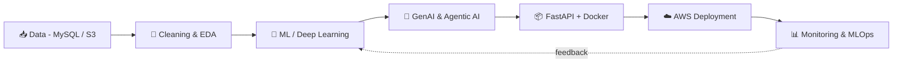

<!-- ═══════════ HEADER ═══════════ -->
<div align="center">


<a href="https://git.io/typing-svg">
  
</a>

<br/>


</div>

---

## 👨‍💻 About Me

```python
class Engineer:
    role      = "Data Scientist & AI/ML Engineer"
    focus     = ["Machine Learning", "Deep Learning", "GenAI", "Agentic AI", "MLOps"]
    languages = ["Python", "SQL"]
    cloud     = ["AWS", "S3", "EC2"]
    mindset   = "Build. Deploy. Monitor. Improve."

    def current_goal(self):
        return "Production-grade AI systems that actually ship 🚀"
```

- 🔭 Currently building **agentic AI systems, RAG pipelines and end-to-end MLOps workflows**
- 🌱 Exploring **LangGraph, multi-agent orchestration, LLM observability and guardrails**
- ⚙️ Passionate about taking models from **notebook → API → container → cloud**
- 📫 Open to collaborations, freelance work and full-time AI/ML roles

---

## 🛠️ Technical Skills

<div align="center">
  
</div>

<br/>

| Domain | Skills |
|:--|:--|
| 🧠 **Generative AI & LLMs** |           |
| 🤖 **Agentic AI** |       |
| 🔬 **Deep Learning** |       |
| ☁️ **MLOps & Cloud** |         |
| 📈 **ML & Statistics** |      |
| 💻 **Programming & Databases** |       |
| 📊 **Visualization & BI** |     |

---

## 🚀 Featured Projects

| Project | What it does | Tech |
|---|---|---|
| 🏠 **[MLOps House Price Prediction](https://github.com/YOUR_GITHUB_USERNAME/house_price_prediction)** | End-to-end MLOps pipeline: data on S3, RandomForest model, MLflow tracking & model registry, FastAPI serving with a custom UI, Dockerized and deployed on EC2 | `Python` `MLflow` `FastAPI` `Docker` `AWS S3` `EC2` `GitHub Actions` |
| 🔍 **[AI GitHub PR Code Reviewer](https://github.com/YOUR_GITHUB_USERNAME/pr-code-reviewer)** | Event-driven reviewer using 5 FastAPI microservices and a 4-agent LangGraph workflow (static analysis, security, architecture, style) with a learner that adapts to team style | `LangGraph` `FastAPI` `Celery` `Redis` `PostgreSQL` `Langfuse` `Prometheus` `Grafana` |
| 🤖 **[Autonomous CI/CD Bug-Remediation Agent](https://github.com/YOUR_GITHUB_USERNAME/cicd-bug-remediation-agent)** | Agentic system that detects CI/CD failures and code issues and proposes automated fixes | `LangGraph` `Azure OpenAI` `Kubernetes` `GitHub Actions` `SonarQube` `Datadog` |
| ❄️ **[Cold-Chain Logistics Dispatch Console](https://github.com/YOUR_GITHUB_USERNAME/cold-chain-dispatch-console)** | ReAct agent that combines SQL Server telemetry, live weather and RAG over compliance rulebooks, with an immutable audit log of every decision | `LangGraph` `SQL Server` `Vector RAG` `Streamlit` `AWS EC2` |
| 🛒 **[AI Shopping Assistant](https://github.com/YOUR_GITHUB_USERNAME/ecommerce-ai-shopping-assistant)** | Modernizes an e-commerce monolith with a guardrailed conversational shopping assistant | `FastAPI` `Pydantic AI` `Groq` `MongoDB Atlas` `Portkey` `Logfire` `Cloud Run` |
| ✈️ **[Travel Planning Multi-Agent System](https://github.com/YOUR_GITHUB_USERNAME/travel-planning-multi-agent)** | LLM-powered planner for destination research, itinerary generation and personalized recommendations | `LangGraph` `GenAI` `Python` |
| ⚖️ **[Contract Risk & Legal Intelligence Agent](https://github.com/YOUR_GITHUB_USERNAME/contract-risk-legal-agent)** | GenAI assistant that analyzes contracts and surfaces risky clauses | `LangChain` `GenAI` `RAG` |

---

## 📈 GitHub Stats

<div align="center">


<br/>


<br/>


</div>

---

## 🧭 What I Do



---

## 🤝 Let's Connect

<div align="center">

<a href="https://www.linkedin.com/in/YOUR_LINKEDIN/"></a>
<a href="mailto:your.email@example.com"></a>
<a href="https://YOUR_PORTFOLIO_URL"></a>
<a href="https://www.kaggle.com/YOUR_KAGGLE"></a>

<br/><br/>

*"Data is the new oil, but models are the engines."* ⚡


</div>
